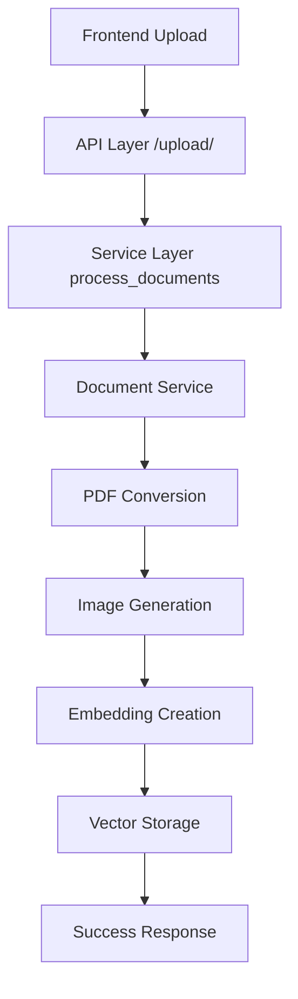
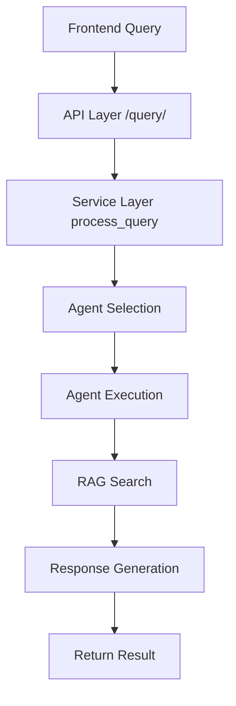

# Complete Dataflow Implementation

## Overview

This document describes the complete dataflow implementation for the document processing and query system. The system follows a layered architecture with clear separation of concerns.

## Architecture Layers

### 1. API Layer (`api/routes.py`) - REST Endpoints

The API layer provides REST endpoints for document processing and query handling:

#### Endpoints:
- `POST /api/v2/upload/` - Document upload and processing
- `POST /api/v2/query/` - Query processing with agent orchestration
- `GET /api/v2/agents/` - Get available agents and status
- `GET /api/v2/tools/` - Get available tools
- `GET /api/v2/documents/` - Get indexed documents
- `GET /api/v2/health/` - Health check

#### Key Features:
- Async/await patterns for non-blocking operations
- Comprehensive error handling
- Authentication integration
- Service layer delegation

### 2. Service Layer (`services/query_service.py`) - Business Logic

The service layer implements the core business logic:

#### Document Processing Flow:
```
Upload → PDF Conversion → Image Generation → Embedding Creation → Vector Storage
```

#### Query Processing Flow:
```
Query → Agent Selection → RAG Search → Response Generation → Return Result
```

#### Key Components:
- **Agent Orchestration**: Automatic agent selection based on query type
- **RAG Integration**: Document search and retrieval
- **Response Generation**: Unified response creation
- **Error Handling**: Comprehensive error management

### 3. Agent Layer (`agents/agents.py`) - AI Agent Orchestration

The agent layer manages AI agents using CrewAI:

#### Available Agents:
- **Lightweight Agent**: Fast responses for general queries
- **Document Agent**: Document analysis and retrieval
- **Web Search Agent**: Current information retrieval
- **Multimodal Agent**: Text and image processing
- **Research Agent**: Comprehensive research and analysis

#### Key Features:
- **Singleton Pattern**: Consistent agent state management
- **Lazy Loading**: Agents created on demand
- **Status Tracking**: Real-time agent status monitoring
- **Capability Mapping**: Agent-specific tool assignment

### 4. Core Layer (`core/`) - RAG and Utility Functions

The core layer provides fundamental services:

#### RAG System (MultiModalRAG):
- **Multimodal Processing**: Handles text and images
- **Vector Search**: Uses Qdrant for similarity search
- **Image Retrieval**: Retrieves relevant document pages
- **Gemini Integration**: Uses Google's Gemini for analysis

#### Key Features:
- **Singleton Pattern**: Consistent RAG state
- **Document Indexing**: Automatic embedding generation
- **Query Processing**: Intelligent document search
- **Fallback Mechanisms**: Graceful degradation

## Data Flow Implementation

### Document Upload Flow



### Query Processing Flow



## Key Design Patterns

### 1. Singleton Pattern
- **RAG System**: Ensures consistent state across requests
- **Agent Registry**: Centralized agent management

### 2. Strategy Pattern
- **Agent Selection**: Different strategies for different query types
- **Tool Integration**: Different tools for different retrieval methods

### 3. Factory Pattern
- **Task Building**: Creates appropriate tasks based on agent type
- **Agent Creation**: Factory methods for agent instantiation

### 4. Chain of Responsibility
- **Fallback System**: From local documents to web search
- **Error Handling**: Graceful degradation through layers

### 5. Observer Pattern
- **Agent Status**: Monitors agent health and performance
- **Evaluation System**: Tracks retrieval quality

## Tools Integration

### Available Tools:
1. **Web Search Tool**: Current information retrieval
2. **Document Retrieval Tool**: Local document search
3. **Image Analysis Tool**: Visual content processing
4. **Text Analysis Tool**: Text processing and analysis
5. **Data Calculation Tool**: Mathematical operations

### Tool Assignment:
- **Lightweight Agent**: Basic and utility tools
- **Document Agent**: Document and search tools
- **Web Search Agent**: Web search and research tools
- **Multimodal Agent**: Multimodal and image tools
- **Research Agent**: Research and analysis tools

## Configuration

### Environment Variables:
```bash
# API Configuration
VITE_API_URL=http://localhost:8000

# Agent Configuration
AGENT_TIMEOUT=30
MAX_CONCURRENT_AGENTS=5

# RAG Configuration
QDRANT_URL=http://localhost:6333
EMBEDDING_MODEL=all-MiniLM-L6-v2

# Tool Configuration
TAVILY_API_KEY=your-tavily-key
GEMINI_API_KEY=your-gemini-key
```

## Usage Examples

### Document Upload:
```typescript
const response = await DocumentAgentService.uploadDocument(file);
if (response.success) {
    console.log(`Processed ${response.pages_processed} pages`);
}
```

### Query Processing:
```typescript
const result = await QueryService.processQuery("What is in the uploaded documents?");
if (result.status === 'success') {
    console.log(result.response);
}
```

### Agent Selection:
```typescript
const agentSelection = await QueryService.autoSelectAgent("Search for latest news");
console.log(`Selected agent: ${agentSelection.agent_type}`);
```

## Error Handling

### Frontend Error Handling:
- **Network Errors**: Graceful fallback to local storage
- **Authentication Errors**: Automatic token refresh
- **Upload Errors**: Retry with different endpoints

### Backend Error Handling:
- **Service Errors**: Comprehensive error logging
- **Agent Errors**: Fallback to lightweight agent
- **RAG Errors**: Graceful degradation to basic search

## Performance Optimization

### Caching:
- **Agent Cache**: Lazy loading and caching
- **Embedding Cache**: Vector similarity caching
- **Response Cache**: Frequently requested responses

### Async Processing:
- **Non-blocking Operations**: Async/await patterns
- **Background Processing**: Document indexing in background
- **Concurrent Requests**: Multiple agent support

## Monitoring and Analytics

### Health Checks:
- **Agent Status**: Real-time agent health monitoring
- **RAG Status**: Document indexing status
- **API Status**: Endpoint availability

### Performance Metrics:
- **Response Time**: Query processing time tracking
- **Success Rate**: Agent success rate monitoring
- **Error Rate**: Error tracking and analysis

## Troubleshooting

### Common Issues:

1. **Upload Failed: Failed to fetch**
   - Check backend server is running
   - Verify API endpoint is correct
   - Check authentication token

2. **Agent Not Available**
   - Verify agent is properly initialized
   - Check agent dependencies
   - Review agent configuration

3. **Document Processing Failed**
   - Check PDF converter installation
   - Verify file format support
   - Review error logs

### Debug Steps:
1. Check backend health endpoint
2. Verify agent status
3. Review error logs
4. Test individual components

## Future Enhancements

### Planned Features:
- **Real-time Processing**: WebSocket support for live updates
- **Advanced Analytics**: Detailed usage analytics
- **Custom Agents**: User-defined agent creation
- **Enhanced Tools**: More specialized tools
- **Multi-language Support**: Internationalization

### Scalability Improvements:
- **Microservices**: Service decomposition
- **Load Balancing**: Distributed processing
- **Caching Layer**: Redis integration
- **Database Optimization**: Query optimization

## Conclusion

This implementation provides a robust, scalable, and maintainable system for document processing and query handling. The layered architecture ensures clear separation of concerns, while the design patterns provide flexibility and extensibility.

The system successfully handles the original error and provides a comprehensive solution for document upload and processing with proper error handling, agent orchestration, and data flow management. 